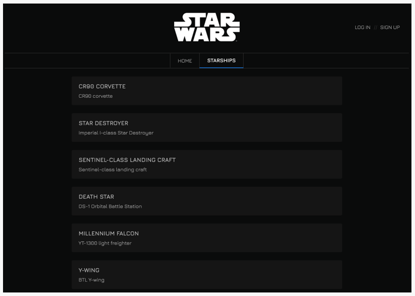

# Star Wars Movies App

## 🌐 Live Demo

https://movie-api-git-master-martapla.vercel.app/

##  👩‍🔧 Project Instructions - React - Using API's. 

This technical test involves: consuming data from an API, displaying it on a screen through a list, and showing the details of each item in the list.

The website you have to develop should display information about Star Wars ships! 
The list of ships with detailed information for each one should be shown.

### 📍 Exercise 1
To begin, the first thing you need to implement is the main screen where the entire list of ships is displayed.

Once implemented on the server, you will see that it returns a lot of interesting data for each ship, but on the main screen, we will only show the most important data to avoid information overload.

Required data for each product (ship) in the list:

-Ship name.
-Model.

### 📍 Exercise 2
In this exercise, you have to create the file for each ship, displaying all its details.

The user can access the details of each ship by clicking on each one through the list.

As you can see, despite being a free API, it is very comprehensive, allowing us to create a very interesting Star Wars informative website!

### 📍 Exercise 3
You already have a basic version of the website created, where the user can view the list of ships and, if desired, see the details by clicking.

However, as you may have noticed, we still have a limit of 10 ships to display. If you look at the API response, you'll see a total of 36 ships, which we will show to the user on demand.

You need to implement a button at the end of the list of ships with the text "View more" that allows fetching more ships from the server and adds them to the list of ships shown to the user.

### 📍 Exercise 4
Change the styles as you see fit. The only criterion is that it closely resembles the official Star Wars website as much as possible.

### 📍 Exercise 5
Just as we have done in previous deliveries, we will implement a welcome homepage, and through a button, users will be able to access the main ships page. To achieve this, you must use React routing.

In addition to the access button on the homepage, the user will have access to the main page through the top navigation bar.

If you haven't implemented the component yet, you will need to create the top navigation bar in a separate component.

### 📍 Exercise 6
You're almost done with the foundation of the project! You need to implement a login and registration screen, using localstorage.
In this exercise, displaying the login and register result in the console will be satisfactory.

#  💾 React + Vite

The project has been developed with Vite due to its speed and efficiency for small projects. 

 

#  🎠 Style

The UI is design by me and I used Tailwind Css. 
The project is also fully responsive, for mobile, tablet and desktop.

